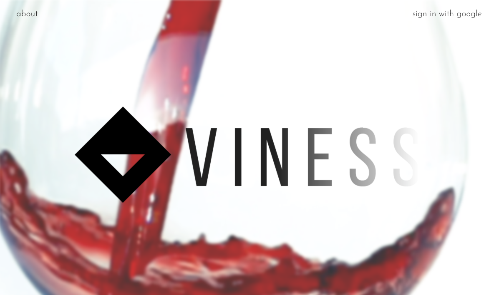
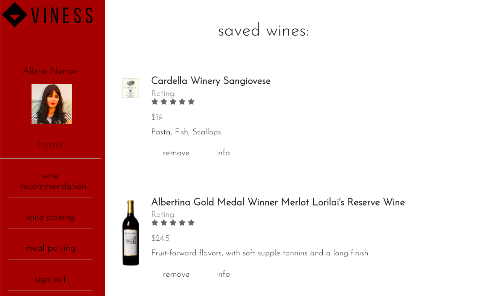
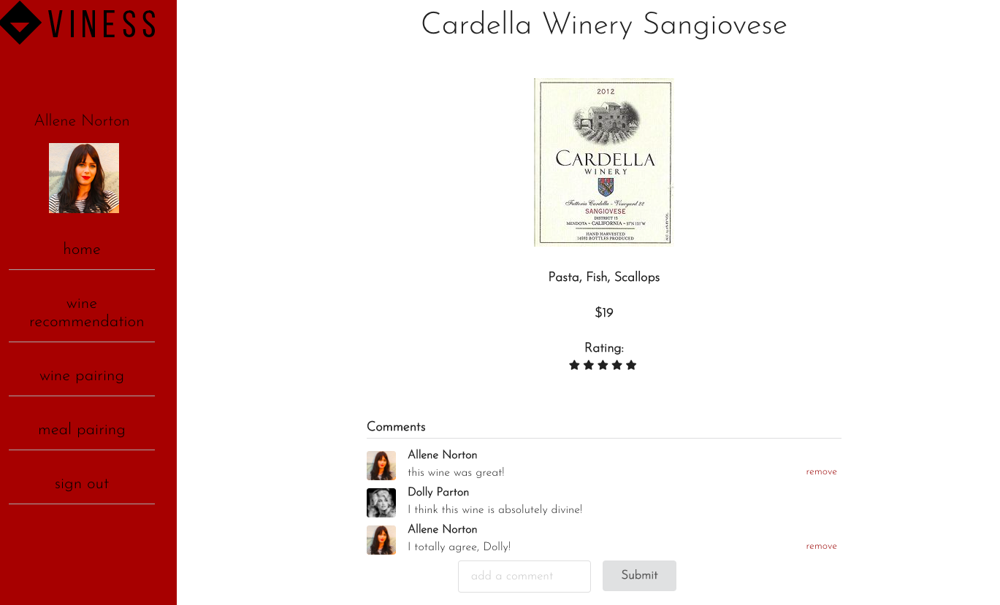
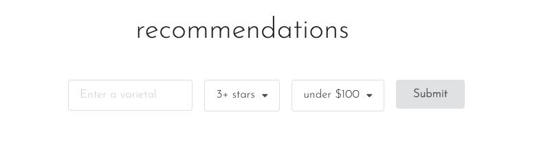
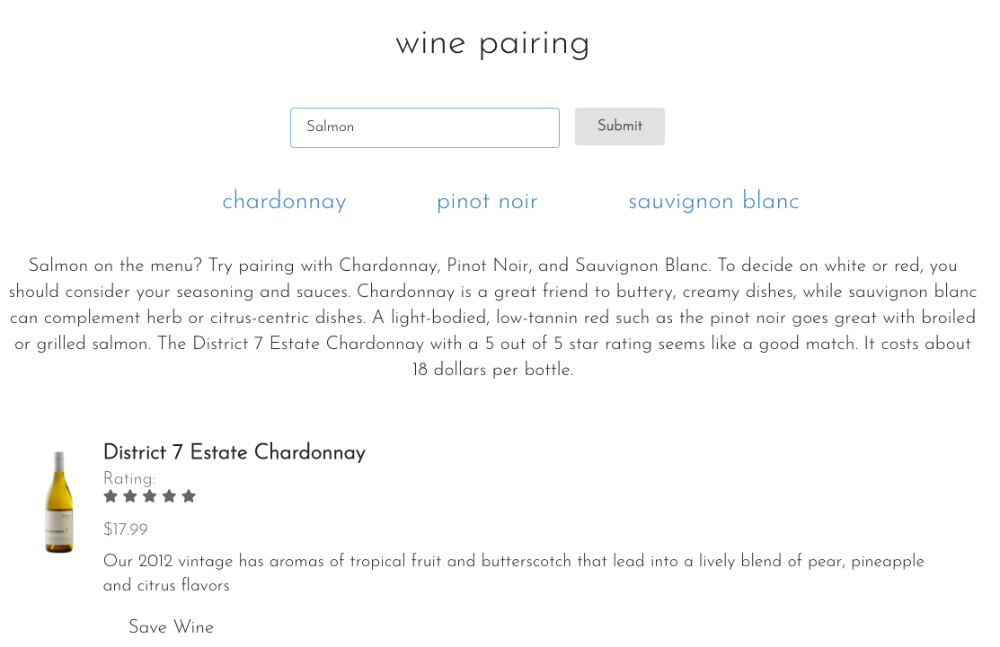
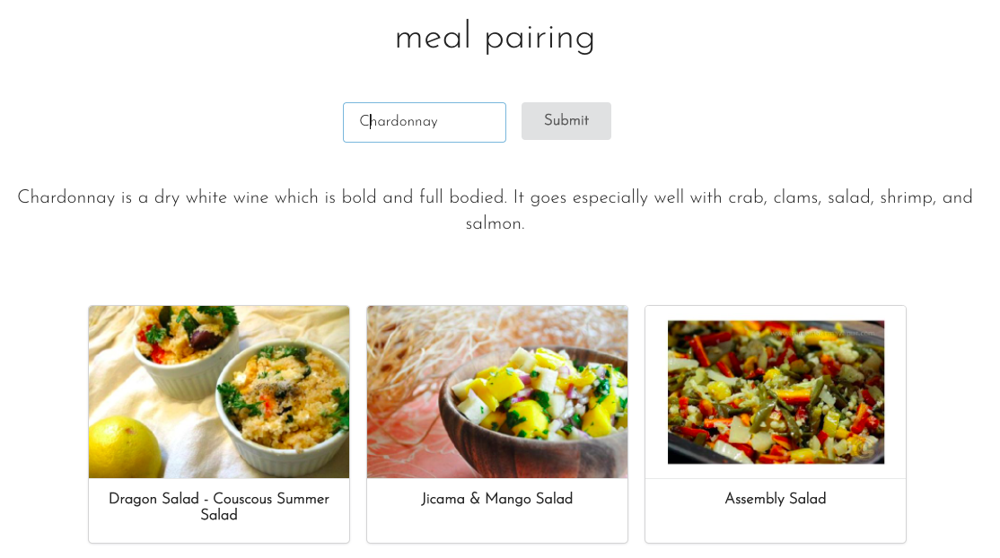

# Welcome to Viness

A wine pairing web application that allows users to get recommended bottles, pair wines with food, and get recommended recipes for your favorite varietals. Once a user saves a wine to their profile, they can view more information and comments about the wine, as well as add their own. Users can sign in with their Google account, making sign-in simple.

### Motivation

I wanted to build an app that made wine pairing simple and fun. I also wanted the option to view recipes that pair with varietals, and the Spoonacular API was perfect for my needs. I also wanted users to be able to interact with other users and discuss wines, which the commenting functionality allows.

### Built With

#### Backend

* Ruby [2.6.1]
* Rails [6.0.3]
* PostgreSQL v13, gem [1.2.3]
* OAuth [0.5.1]
* Hosted by [Heroku](https://www.heroku.com/)

#### Frontend

* React [16.13.1]
* Semantic UI React [1.3.1]
* Custom CSS
* Hosted by [Netlify](https://www.netlify.com/)

### Executing the Program

Viness is hosted at [viness.online](https://www.viness.online)

#### Local Installation
Fork and clone both the [viness frontend](https://github.com/allene-norton/viness-frontend) and [viness backend](https://github.com/allene-norton/viness-backend) repos 

##### Backend

* Run 'rails db:create'
* Run 'rails db:migrate'
* Start the server by running 'rails s'

##### Frontend

* Start the server by running 'npm start'
* Type 'y' to run the server on another port

## API, How To Use, and Credits
### API Reference

Viness uses the [Spoonacular API](https://spoonacular.com/food-api) and Google OAuth for authentication.

### How To Use

From the landing page, click 'sign in with google' in the upper right corner.

Once you're signed in, you'll be taken to your home page.

If you haven't used Viness before, get started by clicking either 'recommendations' or 'wine pairing' from the menu on the left. Otherwise, a list of your saved wines will be displayed. You can delete any saved wine by clicking the 'remove' button.

#### Wine Info

Clicking 'info' on any of your saved wines will bring you to a page with more information about your saved wine.

If there are comments about the wine, they will be displayed. Add a comment using the form at the bottom. You are only able to remove your own comments; do so by clicking 'remove'.

#### Wine Recommendations

Enter a varietal to see a list of recommended bottles. You can also set the minimum rating and the maximum price.

Save any that you like! You will be redirected to the home page, but your search options will remain on this page until you begin a new search.

#### Wine Pairing

Enter a dish (i.e. steak, tacos, chicken piccata), ingredient (i.e. chicken, salmon, potatoes), or cuisine type (i.e. italian, japanese, french) to see a list of varietals that pair well with your meal.

Click on any of the varietal links to automatically run a google search on the varietal.

Check out the description and recommended bottle. If you like, save the bottle to your profile.

#### Meal Pairing

Enter a varietal to see a display of recipes that pair well with your wine.

Click on a recipe to go to the recipe's web page in a new tab.

Functionality for saving recipes coming soon!

#### Signing Out

To sign out, just click 'sign out' from the sidebar. You will be alerted that your logou was successful and redirected to the landing page.

### Credits

Viness was created by Allene Norton as a Flatiron School capstone project.

[GitHub](https://github.com/allene-norton)

[LinkedIn](https://linkedin.com/in/allene-norton)

### Personal Data

Viness only stores certain information from your public Google profile in the database. This is limited to your name, picture, and email address. Viness does not have access to any of your other Google account data. Viness will never share your personal data with any external sources. 

### License

##Learn.co Educational Content License

Copyright (c) 2015 Flatiron School, Inc

The Flatiron School, Inc. owns this Educational Content. However, the Flatiron School supports the development and availability of educational materials in the public domain. Therefore, the Flatiron School grants Users of the Flatiron Educational Content set forth in this repository certain rights to reuse, build upon and share such Educational Content subject to the terms of the Educational Content License set forth here (http://learn.co/content-license). You must read carefully the terms and conditions contained in the Educational Content License as such terms govern access to and use of the Educational Content.

Flatiron School is willing to allow you access to and use of the Educational Content only on the condition that you accept all of the terms and conditions contained in the Educational Content License set forth here (http://learn.co/content-license). By accessing and/or using the Educational Content, you are agreeing to all of the terms and conditions contained in the Educational Content License. If you do not agree to any or all of the terms of the Educational Content License, you are prohibited from accessing, reviewing or using in any way the Educational Content.

This project was bootstrapped with [Create React App](https://github.com/facebook/create-react-app).
